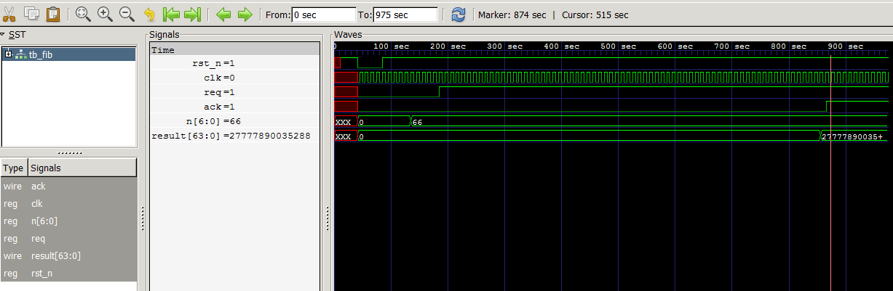

# Fibonacci number calculator in Verilog-HDL

This is a hardware implemetation of [Fibonacci number](https://en.wikipedia.org/wiki/Fibonacci_number) calculator written in Verilog-HDL.
It supports req/ack handshake protocol.

## Required Tools

- [Icarus Verilog(>=10.0)](http://iverilog.wikia.com/wiki/Installation_Guide)
- [Altera Quartus Prime(>=15.0)](https://www.altera.co.jp/downloads/download-center.html)

## Timing chart



66th Fibonacci number is `27777890035288`.

## Source Code Organization

The source code is organized as follows:

```text
docs/       documentation
fpga/       fpga related files
memory/     memory dependencies
rtl/        RTL files for Motion Estimation Processor
testbench/  test suites
tools/      tool for creating mif file
```

## Port declaration
| Port name | IO     | Description               |
| :-------  | :----: | :-----------------------  |
| rst\_n    | input  | low active reset          |
| clk       | input  | clock signal              |
| req       | input  | request for handshake     |
| n         | input  | N'th fibonacci number     |
| ack       | output | acknowledge for handshake |
| result    | output | fibonacci number          |

## Parameters

| Name   | Description                |
| :----- | :------------------------  |
| N\_IN  | bit width of input number  |
| N\_OUT | bit width of output number |
